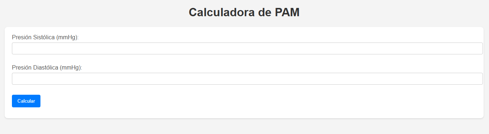

# Calculadora de Presión Arterial Media (PAM)

Este proyecto implementa una calculadora de Presión Arterial Media (PAM) utilizando Flask para el backend y HTML, CSS y JavaScript para el frontend.  Permite al usuario ingresar las presiones sistólica y diastólica, calcula la PAM, interpreta el resultado y valida la presión arterial.

## Descripción

[![YouTube] (https://www.youtube.com/watch?v=oDuLlRt1p1Q&feature=youtu.be)]

La aplicación consta de dos partes principales:

*   **Backend (Flask):**  Maneja la lógica de cálculo de la PAM, la interpretación del resultado y la validación de la presión. Expone un endpoint `/calcular` que recibe las presiones sistólica y diastólica y devuelve la PAM, la interpretación y la validación en formato JSON.
*   **Frontend (HTML, CSS, JavaScript):** Proporciona una interfaz web para que el usuario ingrese las presiones y visualice los resultados.  Realiza una petición POST al endpoint `/calcular` del backend y muestra la información recibida.

## Instalación

1.  **Clonar el repositorio:**
    ```bash
    git clone https://github.com/andreyali/calculadoraPAM.git
    cd calculadoraPAM
    ```

2.  **Crear un entorno virtual (recomendado):**
    ```bash
    python -m venv venv en Windows
    source venv\Scripts\activate en Windows
    ```

3.  **Instalar las dependencias:**
    ```bash
    pip install Flask
    ```

## Uso

1.  **Ejecutar la aplicación:**
    ```bash
    python project.py
    ```

2.  **Abrir el navegador:**  Acceder a `http://127.0.0.1:5000/`

3.  **Ingresar las presiones:**  En la interfaz web, ingresar los valores de presión sistólica y diastólica en los campos correspondientes.

4.  **Calcular:** Hacer clic en el botón "Calcular".

5.  **Visualizar los resultados:**  La PAM calculada, la interpretación y la validación se mostrarán en la página.

## Funcionalidades

*   **Cálculo de PAM:** Calcula la PAM utilizando la fórmula: `PAM = (Presión Sistólica + 2 * Presión Diastólica) / 3`.
*   **Interpretación de PAM:**  Interpreta el valor de la PAM según rangos predefinidos (los rangos específicos deben estar definidos en el código `project.py`).
*   **Validación de Presión:**  Valida las presiones sistólica y diastólica según rangos predefinidos (los rangos específicos deben estar definidos en el código `project.py`).
*   **Interfaz Web:**  Interfaz sencilla y fácil de usar para ingresar datos y visualizar resultados.
*   **Manejo de errores:**  Maneja errores de entrada (ValueError, TypeError) y devuelve códigos de error 400 con mensajes descriptivos.

## Estructura del Proyecto

<nombre_del_proyecto>/
├── project.py      # Archivo principal de la aplicación Flask

├── index.html      # Archivo HTML del frontend

└── README.md       # Este archivo

## Dependencias

*   Flask

## Ejemplo de uso

1.  El usuario ingresa 120 para presión sistólica y 80 para presión diastólica.
2.  La aplicación calcula la PAM: (120 + 2 * 80) / 3 = 93.33 mmHg.
3.  La aplicación interpreta la PAM (ejemplo): "Presión arterial normal".
4.  La aplicación valida la presión (ejemplo): "Presión arterial dentro de rangos normales".
5.  Los resultados se muestran en la interfaz web.


## Autor

(Yalitza Alvarez)

## Licencia